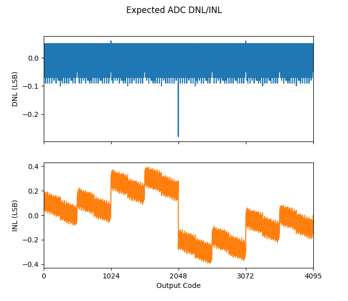

<!---

This file is used to generate your project datasheet. Please fill in the information below and delete any unused
sections.

You can also include images in this folder and reference them in the markdown. Each image must be less than
512 kb in size, and the combined size of all images must be less than 1 MB.
-->

## How it works

This is a 12 bit SAR ADC. The ADC uses ~ 0.8 fF unit capacitors built with the fringe and parallel plate capacitance between the metal1 and metal2 layers.\
The input signal (VIN_P - VIN_N) is sampled for 2 clock cycles if the previous conversion finished, there's a rising edge of the clock signal and the START input is high.\
After the sampling phase, the ADC determines the 12 bits by comparing the sampled input signal with a DAC voltage using a binary search.\
The conversion result can be obtained from the DATA[5:0] outputs. The 6 most-significant bits are sampled at the rising edge of the CLK_DATA output and the 6 least-significant bits at the falling edge.\
The START signal can be kept always high to convert continuously the input signal.

The comparator has a preamplifier with a gain of 20 to 30x. The preamplifier helps to relax the noise requirements of the strongarm latched comparator and makes it more predictable (not possible to run transient simulations with noise in ngspice).
The comparator can calibrate its own offset. To do so, the EN_CAL_OFFSET input needs to be high. At the end of a conversion the comparator inputs are shorted, a comparison is triggered and an offset is introduced on purpose to counteract the comparator offset.

The ADC can be configured to convert a differential signal or a single-ended signal. For a single-ended configuration the ADC has a resolution of 11 bit and for a differential configuration 12 bit. For a differential configuration the inputs (VIN_P and VIN_N) should have a typical common-mode voltage of 0.6 V. For a single-ended configuration the VIN_N input should be close to VSS.

### Pinout

|Name			|Direction		|Type		|Description																					|
|---------------|---------------|-----------|-----------------------------------------------------------------------------------------------|
|VDD			|Input			|Supply		|1.8 V supply input.																			|
|VSS			|Input			|Supply		|Ground.																						|
|VREF			|Input			|Analog		|1.2 V reference voltage.																		|
|VREF_GND		|Input			|Analog		|Reference voltage ground.																		|
|VCM			|Input			|Analog		|0.6 V common-mode voltage.																		|
|VIN_P			|Input			|Analog		|Positive input signal.																			|
|VIN_N			|Input			|Analog		|Negative input signal.																			|
|CLK			|Input			|Digital	|Clock input.																					|
|RST_Z			|Input			|Digital	|Enable input.																					|
|START			|Input			|Digital	|Start conversion input. Keep high to convert continuously.										|
|EN_OFFSET_CAL	|Input			|Digital	|Enables comparator offset self-calibration.													|
|SINGLE_ENDED	|Input			|Digital	|Configures ADC for single-ended input and VIN_N is used as ground reference.					|
|CLK_DATA		|Output			|Digital	|Rising edge used to sample the 6 MSBs and falling edge used for the 6 LSBs of ADC output. 		|
|DATA[5:0]		|Output			|Digital	|Result of the conversion.																		|

### Specification

|Parameter									|Min		|Typical			|Max	|Unit	|
|-------------------------------------------|-----------|-------------------|-------|-------|
|Supply Voltage								|1.7		|1.8				|1.9	|V		|
|Power Consumption							|			|					|		|µA		|
|Temperature								|0			|27					|85		|ºC		|
|Reference Voltage							|1.15		|1.2				|1.25	|V		|
|Input Common Mode Voltage (differential)⁶	|0.5		|0.6				|0.7	|V		|
|Ground Reference Voltage (single-ended)	|-0.1		|0					|0.1	|V		|
|Output resistance for analog inputs		|			|					|500	|Ω		|
|Clock Frequency¹							|			|					|20		|MHz	|
|Clock Low Pulse Width²						|10			|					|		|ns		|
|Sampling Frequency							|			|1/16 of clock freq.|		|		|
|Sampling Capacitance						|			|~ 1.8				|		|pF		|
|INL³										|			|					|		|LSB	|
|DNL³										|			|					|		|LSB	|
|ENOB without noise⁴						|			|					|		|bit	|
|ENOB with noise⁴𝄒⁵							|			|					|		|bit	|
|SNDR without noise⁴						|			|					|		|dB		|
|SNDR with noise⁴𝄒⁵							|			|					|		|dB		|
|SFDR⁴										|			|					|		|dB		|

¹ Input signal is sampled for 2 clock cycles. Clock/sampling frequency is limited by the 500 Ω resistance from the pads to the circuit in the TinyTapeout IC.\
² Clock falling edge triggers the latched comparator, therefore clock low pulse width has to be larger than latched comparator propagation delay.\
³ Typical values for INL/DNL based on C extraction. Mismatch is not included.\
⁴ SNDR/ENOB do not include distortion introduced by TinyTapeout analog MUX.\
⁵ Noise estimated, not obtained directly from simulation.\
⁶ Both 2*VIN(CM)-VCM and VCM should respect the limits to ensure comparator input common-mode voltage range is respected.

### DNL/INL
The DNL and INL were estimated by extracting all the DAC capacitors from the C extraction netlist.
A python script reads the netlist file, extracts all the relevant capacitances and simulates the output of the ADC for a sweep of the input signal in order to calculate the DNL and INL. The results can be seen in the figure below.

## How to test

Apply a differential voltage with a common-mode voltage of 0.6 V to VIN_P and VIN_N. If the ADC is running in the single-ended configuration, connect VIN_N to the ground reference of the input signal and VIN_P to the input signal.\
To measure offset and noise short VIN_P and VIN_N and connect them to 0.6 V.\
Apply a 20 MHz clock signal to the CLK input. The latched comparator is triggered at the falling edge of the CLK signal and the output is sampled at the rising edge. Therefore, the high time of the CLK signal should be long enough to allow the DAC to fully settle and the low time should be larger than the propagation delay of the comparator. Around 10 ns low time should be enough.\
The ADC requires 16 cycles for 1 conversion. The frequency of the clock signal can be increased depending on the resistance between the analog pins and the circuit.\
Set the RST_Z input high to enable the circuit and set the START input high to continuously convert.\
The CLK_DATA pin should oscillate with a frequency of 1.25 MHz (20 MHz / 16).\
The 6 most-significant bits of the conversion result can be sampled on the rising edge of the CLK_DATA signal and the 6 least-significant ones on the falling edge.

## External hardware
